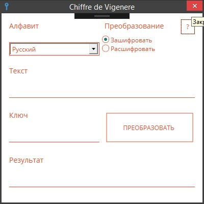

# ChiffreDeVigenereApp

Программа для шифрования по [методу Виженера](https://ru.wikipedia.org/wiki/%D0%A8%D0%B8%D1%84%D1%80_%D0%92%D0%B8%D0%B6%D0%B5%D0%BD%D0%B5%D1%80%D0%B0). Выполнена в качестве курсового проекта по дисциплине "Защита информации"

* C#
* WPF

